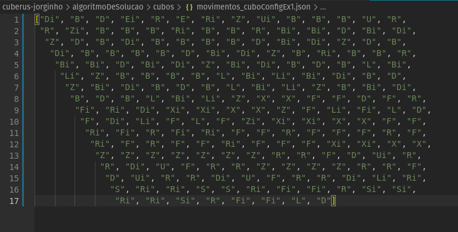

# **Algoritmo de Solução do cubERUS**
#
## Funcionamento:
###     O código *leituraCubo.py* utiliza de um arquivo .json¹ (onde foi salva a configuração do cubo) para criar uma string com um ordenamento específico, que será recebido pelo código *resoluçãoCubo.py* e utilizada pela lib para criar a classe *cube*² e resolvê-lo. Então, esse mesmo arquivo cria um segundo .json³ que contém uma lista com todos os movimentos necessários para se completar o cubo.
#
### 
#### *arquivo lido¹*
### 
#### *ordenação do cubo²*
### 
#### *lista lida³*
#
## Libs Usadas:
###     A lib usada para o algoritmo é o [Rubik Cube](https://pypi.org/project/rubik-cube/), onde foram usadas as classes *cube* e *solver*.